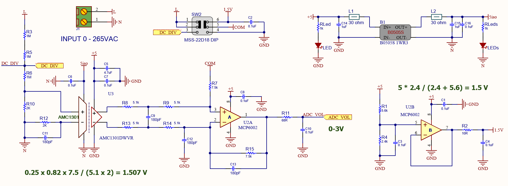

# High Voltage to Isolated ADC Signal Conversion Module

## 1. Principle: Interfacing a Differential-Output (Isolated) Amplifier to a Single-Ended Input ADC

This project follows the principle introduced in the TI application note:  
**[Interfacing a Differential-Output (Isolated) Amp to a Single-Ended Input ADC (TI SBAA229B)](https://www.tij.co.jp/lit/ab/sbaa229b/sbaa229b.pdf)**

The AMC1301 is an isolated amplifier with a differential output. However, many microcontrollers only support single-ended ADC inputs. To resolve this, the differential output of the AMC1301 must be converted to a single-ended signal using a differential amplifier or a voltage divider network.


**Main concepts:**
- AMC1301 provides isolated differential voltage output
- A differential op-amp or resistor network converts it to single-ended signal
- Output voltage is within the 0–3.3V range (with ~1.5V DC offset for AC sensing)
- Ensures electrical isolation and safe interfacing with high voltage systems



---

## 2. AC/DC Measurement Mode with DC Offset Biasing

This design includes a switch for selecting between **AC** and **DC** measurement modes.

- **DC Mode**: The signal tracks the measured voltage linearly
- **AC Mode**: The signal is biased with a 1.5V DC offset to ensure it stays within ADC range (0–3.3V). The ADC reads a sine wave centered around 1.5V.

**Notes:**
- The 1.5V offset can be generated using a voltage divider or a 1.5V reference
- Helps accurately measure bipolar signals using a unipolar ADC

---

## 3. Sample Firmware (Arduino): Moving RMS Measurement

Below is a sample Arduino Firmware using a *Moving RMS* algorithm to read AC signals with a DC offset:

```cpp
#include <avr/interrupt.h>
#include <math.h>

#define OFFSET_VOL 1.504f
#define OFFSET_ADC 308.00f
#define FACTOR_ADC 1.42286217f
#define MOVING_RMS_MAX_BUF 100

volatile float voltageValue;
volatile float rms;

typedef struct {
  uint16_t L;
  float invL;
  uint16_t count;
  float in_sq_L[MOVING_RMS_MAX_BUF];
  float out_sq;
  float rms;
} MovingRMS;

MovingRMS mrms;

void MovingRMS_Init(MovingRMS *mrms, uint16_t L) {
  mrms->L = L;
  mrms->invL = 1.0f / L;
  mrms->count = 0;
  for (uint16_t n = 0; n < L; n++) mrms->in_sq_L[n] = 0.0f;
  mrms->out_sq = 0.0f;
}

void MovingRMS_Update(MovingRMS *mrms, float in) {
  float in_sq = in * in;
  mrms->in_sq_L[mrms->count] = in_sq;
  if (mrms->count == (mrms->L - 1)) {
    mrms->count = 0;
  } else {
    mrms->count++;
  }
  mrms->out_sq += mrms->invL * (in_sq - mrms->in_sq_L[mrms->count]);
}

ISR(TIMER1_COMPA_vect) {
  voltageValue = (float(analogRead(A0)) - OFFSET_ADC) * FACTOR_ADC;
  MovingRMS_Update(&mrms, voltageValue);
}

void setup() {
  Serial.begin(115200);
  MovingRMS_Init(&mrms, MOVING_RMS_MAX_BUF);
  
  // Timer1 setup at 5kHz
  TCCR1A = 0;
  TCCR1B = (1 << WGM12) | (1 << CS10);
  OCR1A = 3199;  // 16MHz / 3200 = 5kHz
  TIMSK1 |= (1 << OCIE1A);
  
  sei();
}

void loop() {
  rms = sqrt(mrms.out_sq);
  Serial.println(rms);
}
